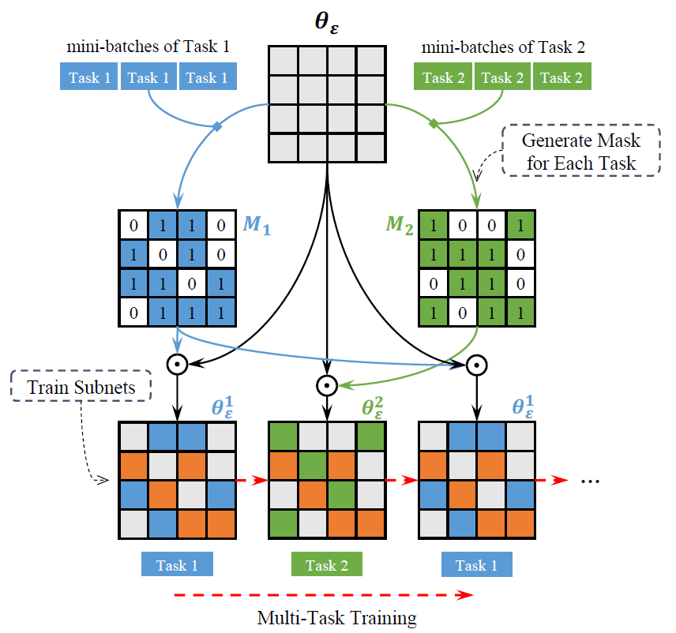

# Learning Sparse Sharing Architectures for Multiple Tasks

This is a Pytorch implementation for [Learning Sparse Sharing Architectures for Multiple Tasks](https://arxiv.org/pdf/1911.05034.pdf), accepted by AAAI 2020 (Oral). 

<p align="center">

</p>

Illustration of our approach to learn sparse sharing architectures. Gray squares are the parameters of a base network. Orange squares represent the shared parameters, while blue and green ones represent private parameters of task 1 and task 2 respectively.

## Requirements

- pytorch == 1.2.0 
- fastNLP == 0.5.0

## Data
There are three experiment settings in our original paper: 
- `conll03`: Conll2003 (POS + Chunk + NER)
- `ontonotes`: OntoNotes 5.0 (POS + Chunk + NER)
- `ptb`: PTB (POS) + Conll2000 (Chunk) + Conll2003 (NER)

In this instruction, we give an example to reproduce the experiment on `conll03`.

**UPDATE:** We provide the dataset **Conll03(POS + Chunk + NER) and PTB(POS)** for reproducibility of our experiments,
stored in `./data` folder. 

To process the dataset, run the following code.
And the processed data will be saved at `./data` folder.

```shell script
python prepare-data.py \
  --type conll03 \
  --pos /path/to/pos \
  --chunk /path/to/chunk \
  --ner /path/to/ner
```


## Training
There are two kinds of training in our experiments:

- `single`: Learning sparse sharing architecture, generating subsets for each task.
- `mtl`: Training subsets in parallel.

#### Single task pruning
The first step is to generate subnets for each task. This is done by running:
```shell script
bash run_conll03.sh single
```
We suggest generate subsets with Multi-Task Warmup, by running:
```shell script
bash run_conll03.sh single /path/to/mtl-checkpoints
```

The generated subsets are stored in the folders named after numbers under `./exp/conll03/single/cp/`,
The subsets' are named after `[#pruning]_[nonzero param percent].th`.
You can choose different subsets for each task by editing the numbers `MASK_LIST` in the script `prepare-masks.sh`,
where each number represents the number of pruning, `#pruning`.
After editing the numbers, run:
```shell script
bash prepare-masks.sh conll03
```
to prepare the masks and initial checkpoints for multi-task training.

#### MTL training
Run the following script for multi-task training with different subsets in parallel:
```shell script
bash run_conll03.sh mtl
```
**Note**: before running another MTL training, edit the `NAME` variable in `run_conll03.sh` to specify a different name for the training run.
Otherwise, the previous experiment results may be overwritten.

#### Evaluation
When the training finished, the model will be evaluated on the test sets automatically.

#### More
You can also directly run the python file `train_single.py` and `train_mtl.py` with different arguments to gain more flexibility.
And please use the argument `-h` to see the full arguments descriptions.

## Citation

```
@inproceedings{sun2020sparsing,
  author = {Tianxiang Sun and Yunfan Shao and Xiaonan Li and Pengfei Liu and Hang Yan and Xipeng Qiu and Xuanjing Huang},
  title = {Learning Sparse Sharing Architectures for Multiple Tasks},
  booktitle = {Proceedings of the AAAI Conference on Artificial Intelligence},
  year = {2020},
  url = {https://arxiv.org/abs/1911.05034}
}
```

## Acknowledgments
[fastNLP](https://github.com/fastnlp/fastNLP)
